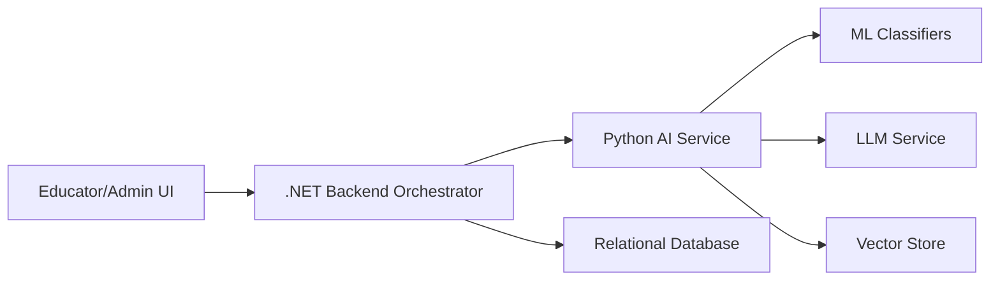

# AiKita Planning Repository

Planning, strategy, and delivery documentation for the practical AiKita project.

## Project Overview
This software is designed to support educators in planning educational processes based on children's behavior. By analyzing observed behaviors with AI and suggesting matching educational areas, goals, and activities, this software sets itself apart from planning software currently available on the market for the pedagogical sector.

## Project Snapshot
AiKita is an AI-supported planning platform for early childhood education. The system turns pedagogical observations into structured recommendations (educational area, goals, and activity ideas) while keeping data protection, auditability, and daily usability in focus.

This repository is the planning and management companion to the implementation work: product scope, sprint planning, QA targets, velocity tracking, and roadmap decisions.

## Why This Project Matters
- Reduces documentation overhead for educators by streamlining planning workflows.
- Supports pedagogical decision-making with a hybrid AI pipeline (deterministic + LLM-assisted).
- Prioritizes secure handling of sensitive child-related data.
- Connects product planning with measurable delivery metrics.

## Collaborators
- Sarah Rio
- Ralph Mann
- Juergen Huber

## Architecture At A Glance


## Quick Links
### Project Overview
- [Detailed project overview](docs/project-overview.md)
- [Architecture and AI pipeline details](docs/architecture-and-ai.md)
- [Feature scope and quality goals](docs/feature-scope-and-quality.md)

### Planning Artifacts
- [Project proposal](https://github.com/riosarah/AiKita?tab=readme-ov-file)
- [User stories](syp/user_stories.md)
- [Process documentation](syp/ProcessDocumentation.md)
- [Sprint overview](syp/sprints_overview.md)
- [Velocity and forecasting](syp/velocity.md)
- [Projection and roadmap planning](syp/projection.md)
- [Quality commitment statement](syp/Quality_commitment.md)

## Timeline

```mermaid
gantt
    title AiKita
    dateFormat  MM
    axisFormat  %b

    section Planning
    Kick-off & Discovery :done, p1, 2025-01-01, 2w
    Techstack and Design :active, p2, after p1, 4w
    Planning :p3, after p2, 6w

    section MVP
    MVP Development :p4, 2025-04-01, 10w
    Integration & Testing :p5, after p4, 3w

    section Connecting the Dots
    MVP+ :p6, 2025-09-01, 6w
    AI ? :p7, 2025-09-01, 6w
    DB's :p8, 2025-09-01, 6w
    Security :p9, 2025-09-01, 6w

    section Pre Launch
    Final Integration :p10, 2025-10-15, 6w
    Alpha Testing :p11, after p10, 4w

    section Launch Prep
    Beta Testing :p12, after p11, 4w
    Bugfixing & Finetuning :p13, 2026-02-01, 2w

    section Release Candidate
    RC :p14, after p13, 2w
    Bugfixing & Finetuning :p15, after p14, 2w
    v1.0 :p16, after p15, 2w
```


## Techstack (Original Planning Draft)
```c
+-------------------------------------------------------+
|              Local Desktop Application                |
|          (Angular + Electron/Tauri + C#/.NET)         |
|                                                       |
|  +-----------------------------------------------+    |
|  | Desktop UI (Angular + Electron or Tauri)      |    |
|  | Data Entry & User Interaction                 |    |
|  +------------------------+----------------------+    |
|                           |                           |
|                           v                           |
|  +-----------------------------------------------+    |
|  | Local Data Anonymization API (.NET Web API)   |    |
|  +------------------------+----------------------+    |
|                           |                           |
|                           v                           |
|  +-----------------------------------------------+    |
|  | Local Database (SQLite or SQL Server Express) |    |
|  | with Encryption (SQLCipher or TDE)            |    |
|  +------------------------+----------------------+    |
|                           |                           |
|                           v                           |
|  +-----------------------------------------------+    |
|  | JSON Serialization (System.Text.Json in .NET) |    |
|  +------------------------+----------------------+    |
|                           |                           |
|                           v                           |
|  +-----------------------------------------------+    |
|  | Secure Transmission (HTTPClient/.NET HTTPS)   |    |
|  +------------------------+----------------------+    |
+---------------------------|---------------------------+
                            |
                            v
                [Internet / Secure Channel (HTTPS)]

                               |
                               v
+-------------------------------------------------------------+
|                      Cloud Backend (.NET)                   |
|                                                             |
|  +-------------------------------------------------------+  |
|  | ASP.NET Core Web API                                  |  |
|  +---------------------------+---------------------------+  |
|                              |                              |
|                              v                              |
|  +-------------------------------------------------------+  |
|  | PostgreSQL or SQL Server (Azure SQL or managed DB)    |  |
|  +---------------------------+---------------------------+  |
|                              |                              |
|                              v                              |
|  +-------------------------------------------------------+  |
|  | Background Tasks & Queue (Hangfire / Quartz.NET)      |  |
|  | using Redis or RabbitMQ                               |  |
|  +---------------------------+---------------------------+  |
|                              |                              |
|                              v                              |
|  +-------------------------------------------------------+  |
|  | AI Analysis (ML.NET / ONNX Runtime / TensorFlow.NET)     |
|  +---------------------------+---------------------------+  |
|                              |                              |
|                              v                              |
|  +-------------------------------------------------------+  |
|  | Vector Database (Qdrant / Weaviate via REST APIs)     |  |
|  +---------------------------+---------------------------+  |
|                              |                              |
|                              v                              |
|  +-------------------------------------------------------+  |
|  | Admin Interface & Web Frontend (Angular + TypeScript) |  |
|  +-------------------------------------------------------+  |
+-------------------------------------------------------------+
```

## Repository Purpose
This repository is intentionally focused on planning and delivery transparency for stakeholders, collaborators, and potential employers who want to understand the product direction, technical decisions, and execution discipline behind AiKita.


